# Rapport - Labo sans fil
## Introduction
Dans ce laboratoire, nous nous sommes intéressés à la transmission et au traitement de données dans un contexte IoT à l'aide du réseau LoRaWAN et de la plateforme TTN (The Things Network).

L'objectif était de comprendre le fonctionnement complet d'une chaîne de communication, depuis lenvoi de données par un capteur jusquà leur réception, leur décodage et leur exploitation sur un serveur. Nous avons notamment observé les messages uplink, mis en place un décodeur de payload, puis configuré un webhook HTTP afin de recevoir les données dans un conteneur.

Nous avons ensuite développé un script PHP permettant de traiter, stocker et afficher les données reçues, ainsi que d'identifier des situations anormales. Enfin, nous avons comparé différents formats de transmission (JSON et Protocol Buffers) afin d'évaluer leur impact sur l'exploitation des données.

Ce laboratoire s'inscrit dans la continuité des notions vues en réseau et en développement web, et permet d'illustrer concrètement le fonctionnement d'une architecture IoT complète, depuis la communication sans fil jusqu'au traitement côté serveur.

## Manipulations et observations
### Visualisation TTN et identification des gateways LoRaWAN
Après l'authentification sur le site TTN, nous sommes arrivés sur le dashboard de notre capteur LoRaWAN. Nous avons sélectionné l'onglet "Live data" du dashboard, puis appuyé sur le bouton du capteur afin de visualiser notre première donnée transmise.

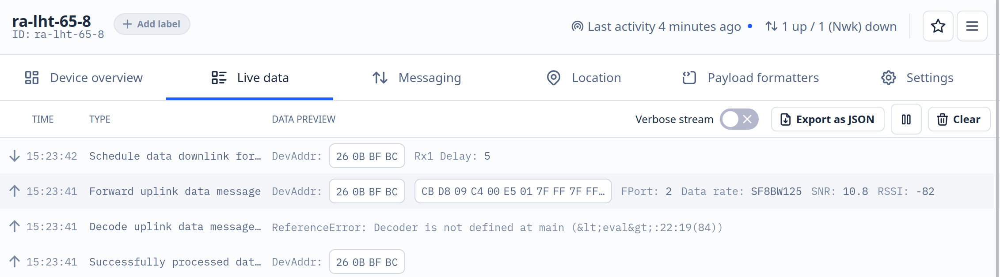

Nous observons les étapes de traitement de l'uplink:
1. Forward uplink: réception du message
2. Decode uplink: tentative de décodage (échoue, pas de décodeur)
3. Schedule downlink: éventuelle réponse planifiée
4. Successfully processed: fin du traitement

En cliquant sur une de ces étapes, cela ouvre le détail de cette dernière au format JSON. C'est ici que nous pouvons voir par quel gateway notre message passe.

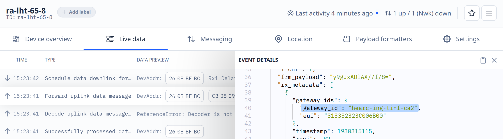

Dans notre cas, nous pouvons lire que notre message passe par un gateway de la HE-Arc.

### Test de simulation des données

Dans l'onglet "Messaging", puis la section "Simulated uplink" du dashboard, nous pouvons simuler un message qui pourrait être envoyé par le capteur. C'est pratique quand l'appareil physique n'est pas  à portée de main.

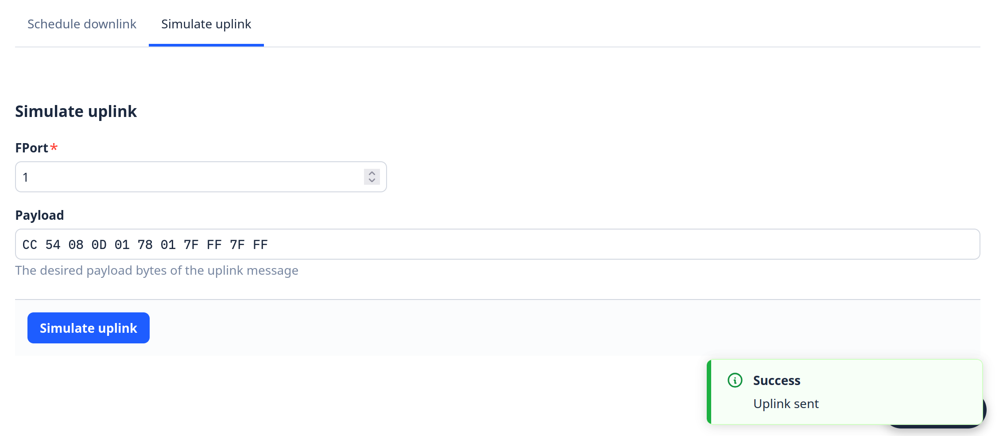

Ensuite, nous pouvons vérifier dans l'onglet "Live data" que nous recevons bien un message, comme s'il provenait du capteur.

### Test et optimisation d'un décodeur JavaScript TTN
Nous avons ensuite mis en place un décodeur afin de "décrypter" les messages en hexadécimal. Nous sommes repartis de l'exemple fourni du cours.

Avec cette base, les messages en hexadécimal deviennent un format JSON qui nous retourne des informations sur la batterie:

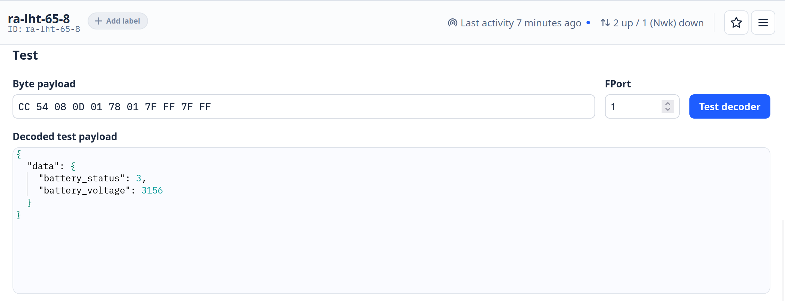

Puis nous l'avons complété en suivant le commentaire en haut du code.

Lien vers le code complet: [code/payload-decode.js](code/payload-decode.js)

Avec le décodeur complété nous pouvons maintenant voir en plus les informations du capteur (humidité et température):

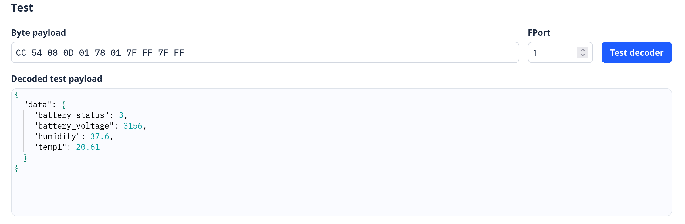

### Accès au conteneur ALPHANET-DS
Après la connexion à la machine distante via SSH, nous avons mis à jour le système du conteneur, installé netcat et ouvert un serveur TCP sur le port 80 grâce à la commande `nc`.

Ensuite, depuis un navigateur web, nous sommes allés sur l'adresse http://193.72.186.153:8087/script.php.
Nous voyons bien que le serveur ouvert précédemment a bien reçu une requête GET avec les entêtes client (User-Agent, Host, Accept, etc).

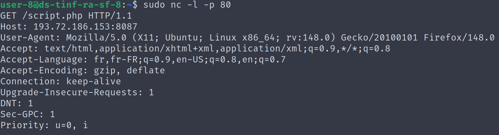

### Intégration Webhook HTTP dans ALPHANET-DS
#### Installation de PHP et déploiement de l'application

Nous avons installé PHP en mode standalone. Nous avons ensuite créé un répertoire `/html` afin d'héberger les fichiers de l'application. Nous avons ensuite lancé le serveur web intégré de PHP pour servir le contenu du répertoire courant.

Ce serveur minimal permet de tester rapidement une application.

Un script PHP de base nous a été fourni, nous l'avons déployé sur le conteneur à l'aide d'une commande scp.

Afin de simuler le comportement d'une future intégration avec TTN, nous avons testé notre script PHP en envoyant une requête HTTP POST.

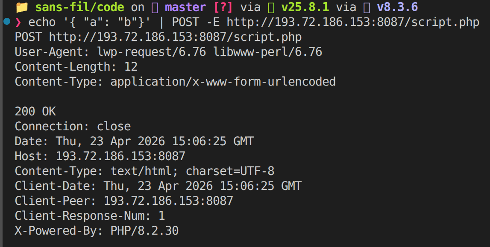

#### Intégration Webhook avec TTN

Sur le site TTN, nous avons créé une nouvelle intégration webhook qui renseigne le lien de notre script PHP.

En allant via un navigateur sur notre script, nous pouvons voir ce message dans notre serveur php, ce qui nous intéresse c'est le payload:

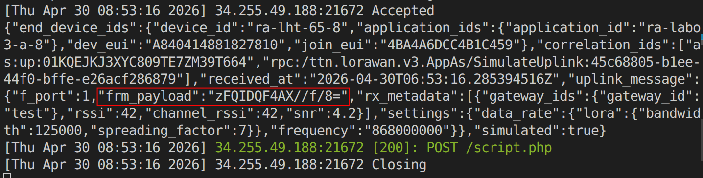

Le payload ci-dessus reçu n'était pas exploitable directement. Nous avions toutefois déjà effectué des tests avec un payload formatter. Nous l'avons activé.

Maintenant, les données deviennent interprétables et peuvent être lues au format JSON.

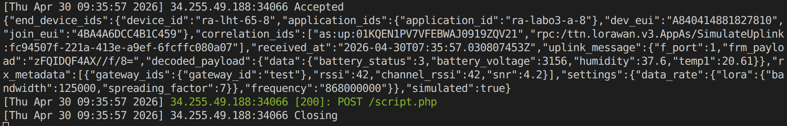

### Affichage des données

Après la mise en place du webhook et du déploiement du script PHP sur le conteneur, nous avons mis en place l'affichage des données reçues.

Le script récupère les messages envoyés par TTN via une requête HTTP POST. Les données sont extraites depuis le payload JSON et stockées dans un fichier local afin de conserver la dernière valeur reçue.

Ces informations sont ensuite affichées sur une page web générée en PHP. Les valeurs de température, d'humidité et de batterie sont directement visibles dans le navigateur.

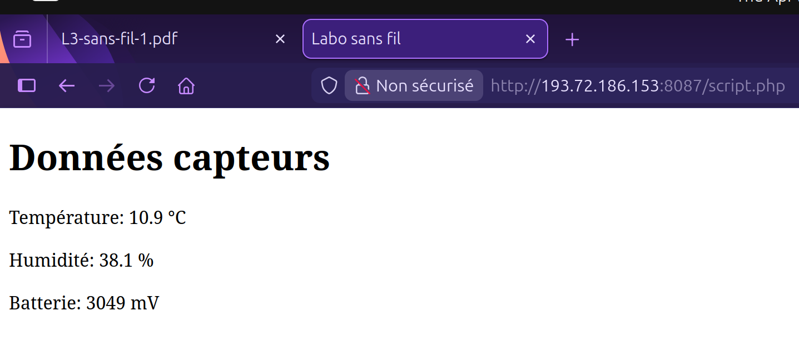

La page se met à jour automatiquement toutes les 10 secondes afin de permettre un suivi quasi temps réel des données du capteur.

### Gestion des alertes
En complément de l'affichage des données brutes, nous avons ajouté un système d'alertes afin d'interpréter les valeurs reçues et détecter des situations anormales.

Le script PHP récupère les données capteurs (température, humidité et tension de batterie) et les compare à des seuils définis. Si une valeur sort de la plage considérée comme normale, une alerte correspondante est générée.

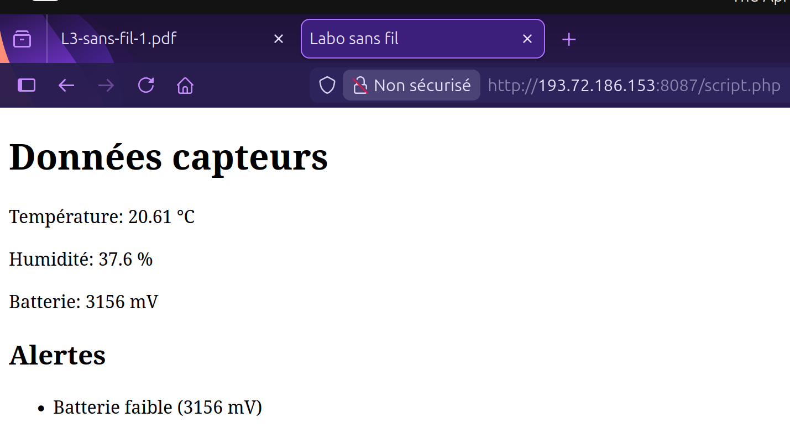

Les alertes générées sont ensuite affichées dynamiquement sur la page web sous forme de liste. Cela permet une lecture rapide de l'état du système sans analyser directement les valeurs numériques.

### Webhook JSON vs Protocol Buffers
Afin d'obtenir des logs exploitables, nous sommes revenus au script PHP de base et avons désactivé le payload formatter.

Nous avons ensuite simulé un uplink depuis TTN afin d'observer la requête POST reçue par notre serveur. Dans un premier temps, nous avons utilisé le format JSON (format par défaut), puis nous avons testé le format Protocol Buffers.

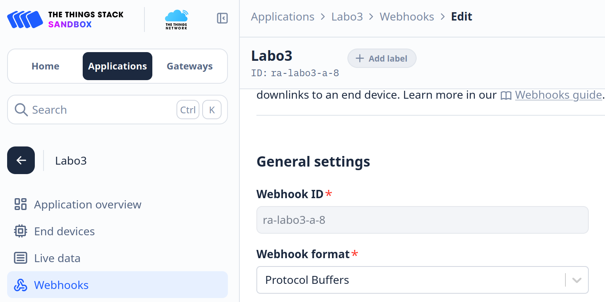

En format JSON, les données sont lisibles et structurées. Le payload est présent dans le champ frm_payload. Bien que ce contenu ne soit pas directement interprétable, il reste facilement décodable et exploitable.

En revanche, en format Protocol Buffers, les données reçues apparaissent sous forme binaire. Elles ne sont pas lisibles dans le terminal et ne peuvent pas être traitées directement par le script PHP.

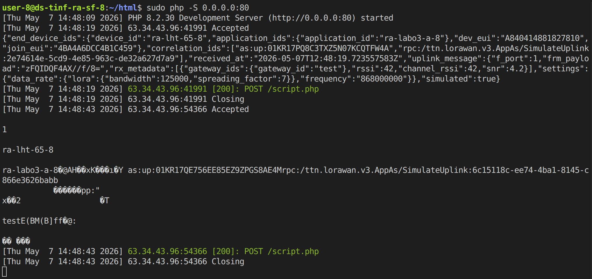

Nous en déduison que le format JSON est plus adapté dans notre cas, car il permet une manipulation simple des données, contrairement au format Protocol Buffers qui nécessite un décodage spécifique. Cependant, ce dernier est plus compact et optimisé pour la transmission, ce qui le rend plus efficace côté machine.

## Conclusion
Au cours de ce laboratoire, nous avons observé le fonctionnement d'un capteur LoRaWAN via TTN, notamment la réception des messages uplink et leur traitement.

Nous avons mis en place un décodeur permettant de transformer les données brutes en informations exploitables (température, humidité et batterie). Nous avons également utilisé un conteneur pour héberger un serveur recevant ces données via un webhook HTTP.

Les données reçues ont ensuite été traitées par un script PHP, stockées localement, puis affichées sur une interface web avec une mise à jour automatique. Un système d'alertes a également été ajouté afin de signaler les valeurs anormales.

Enfin, nous avons comparé les formats JSON et Protocol Buffers pour la transmission des données. Nous avons constaté que le format JSON est directement exploitable dans notre cas, tandis que le format Protocol Buffers nécessite un traitement supplémentaire car il est binaire.

## Reponse aux questions du compte-rendu
### 1. Relier deux LAN Ethernet via un bridge WIFI
#### a) Est-ce normal ? Que se passe-t-il probablement ? Quel est le risque éventuel ?

##### Est-ce normal?
Non.

Un vrai bridge en couche 2 devrait relayer les trames mais conserver l'adresse MAC source originale de l'expéditeur.

##### Que se passe-t-il probablement?

Les access points en mode "bridge" fonctionnent plutôt en mode **relais avec réécritureMAC** (MAC rewriting/source MAC replacement):

1. Du côté LAN1: L'Access point reçoit une trame d'une machine (ex: MAC_A)
2. En transit: Au lieu de conserver MAC_A, l'AP **remplace l'adresse MAC source par sa propre adresse MAC** (MAC_AP1)
3. Du côté LAN2: Toutes les machines du LAN1 apparaissent avec l'adresse MAC de l'AP du LAN1

Ce qui expliquerait pourquoi toutes les machines du LAN1 possèdent la même adresse : ce serait celle de l'Access point.

Cependant, tout fonctionne "normalement" car TCP/IP utilise les **adresses IP** (couche 3), pas les adresses MAC, pour le routage général. On aura des problèmes en cas d'utilisation de protocole dépendant des adresses MAC.

##### Risques éventuels?

**Perte d'information d'adressage**
- Il est impossible d'identifier la véritable machine source du LAN1 à partir du LAN2.
- Les adresses MAC originales sont perdues.

**Problèmes avec ARP**
- Les tables ARP ne reflètent pas la topologie réelle
- Une machine du LAN2 qui veut faire un ping à une machine du LAN1 doit passer par l'AP, pas directement. Il y a donc un risque d'**incohérence ARP** si les réponses ARP ne sont pas cohérentes avec le flux de données

**Problèmes de sécurité**
- Certains filtres / politiques de sécurité ne s'exécuteraient pas, car on pourrait penser que tout vient du même AP à cause de l'adresse MAC identique

### b) Consultation du format de trame 802.11, explication de comment les 4 adresses devraient être utilisées, si cette fonction bizarre n'était pas activée

Une trame 802.11 contient jusqu'à **4 champs d'adresse MAC**, dont l'utilisation dépend de deux flags :
- **To DS** (To Distribution System) : 1 = la trame est destinée au système de distribution (AP)
- **From DS** (From Distribution System) : 1 = la trame provient du système de distribution (AP)

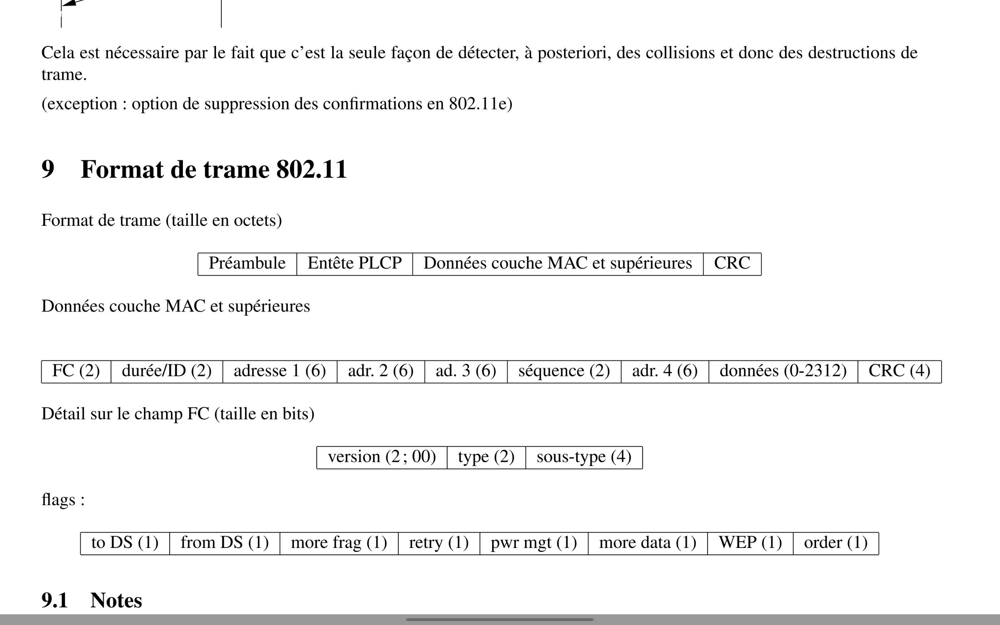

#### Utilisation des 4 adresses selon To DS / From DS :

| To DS | From DS | Addr1 | Addr2 | Addr3 | Addr4 | Contexte |
|-------|---------|-------|-------|-------|-------|----------|
| 0 | 0 | DA | SA | BSSID | N/A | Ad-hoc, infra client→AP |
| 0 | 1 | DA | BSSID | SA | N/A | AP → client |
| 1 | 0 | BSSID | SA | DA | N/A | Client → AP (distribution) |
| 1 | 1 | Rcv AP | Transmit AP | DA | SA | **WDS/Bridge** ← Mode bridge transparent |   

On remarque que le mode "ad-hoc" est utilisé quand les deux champs "To DS" et "from DS" sont à 0, et que le mode bridge se passe quand les deux champs sont à 1.

C'est le **mode WDS/bridge transparent** qui devrait être utilisé pour un vrai bridge 802.11. Cela permettrait de préserver à la fois l'identité des APs (sans fil) et l'identité des machines Ethernet originales (câblées).

Ce n'est pas le cas avec la configuration utilisée ici: les APs simples en mode "bridge" n'utilisent pas le mode 4 adresses, mais le mode **(1,0)**.

### 2. exemple de secret partagé qui permette d’atteindre 256 bits

L'entropie d'un mot passe choisi parmi 94 caractères ASCII imprimables,
choisis aléatoirement et sur une longueur de 40 caractères, vaut: 

$$H = 40 * log(94) \approx  262 bits$$

Un exemple de secret partagé robuste serait de générer 40 caractères aléatoires parmi un alphabet qui serait plutôt large.
Voici un exemple:
vT7!qZ@2Lm#8xR$4Pw9&Ks1^Nd6*Hy3+Uf0!Cb

#### Exemple "parfait"
Le meilleur cas serait d'utiliser des caractères hexadécimaux pour représenter une clé purement aléatoire de 256 bits. Chaque caractère représente 4 bits:

$$64 * 4 = 256 bits$$

On arrive à exactement 256 bits d'entropie.

#### avancés : comment peut-on, si un mot de passe n’a pas une entropie suffisante, stretcher 10 la clé pour améliorer la situation
* En utilisant une fonction de hash
* 
!! on applique des milliers/millions d’itérations,
parfois avec coût mémoire élevé,
pour dériver une clé AES à partir du mot de passe.

Ralentit fortement les attaques par brute force car il augmente le coût de calcul pour l'attaquant.

### 3. qu’est-ce qu’un portail captif dans le contexte de la sécurisation d’un réseau sans-fil sans chiffrement ? y-a-t-il des problèmes avec cette stratégie ?
C'est une page web d'authentification s'affichant automatiquement, imposant des conditions (connexion, acceptation des conditions) avant de pouvoir accéder à un réseau sans fil.

Problème: le wifi reste non chiffré, même si une authentification est requise. Les trames peuvent être interceptées et un attaquant proche pourrait écouter le trafic.

### 4. faites un schéma couche 3 et couche 2 du pont WiFi dans la variante où les équipements réseau sont administrés dans un VLAN séparé, placez un PC d’administration et indiquez quels ports sont en trunk et quel port est en access

### 5. avec deux antennes à gain 30 dB, quelle distance pourriez-vous atteindre ? quel serait le problème de cette liaison ?
On pourrait atteindre plusieurs dizaines de kilomètres, mais cela dépend de certains facteurs:
* Le faisceau à ce niveau de dB est très étroit, il faut être sûr de bien les avoir alignés
* Avoir une ligne de vue dégagée (zone de Fresnel).

Problème possible: la puissance isotrope rayonnée équivalente (EIRP) est souvent réglementée selon les pays. 

$$EIRP=Pemission ​+ Gantenne​$$

Si on suppose :
* Wi-Fi 5 GHz,
* puissance émission = 20 dBm,
* antennes = 30 dBi chacune,
* sensibilité réception ≈ −75 dBm.

Si on a 30 dB de gains, on arrive à 80 (30+30+20), ce qui dépasse les limites légales. Il est alors nécessaire de réduire la puissance d'émission.

#### Problème de la liaison : 
* Risques d'interférence (perturbations radio, meteo, arbres)
* Limites légales.

### 6. donnez des arguments pour l’exploitation en mode bridge et en mode routeur au sein de l’entreprise (les réseaux filaires et sans-fils sont respectivement switchés et routés)
### Bridge
En mode Bridge, les utilisateurs sans fil et filaire sont dans le même réseau de couche 2.

Avantages: 
* Partage facile, par exemple avec une imprimante
* Même plan d'adressage IP
* Broadcast

Désavantages: 
* Sécurité plus faible entre wifi et filaire
* Grand domaine de broadcast
* Propagation possible (tempête broadcast, attaques ARP)

#### Mode routeur
En mode routeur, le wifi est séparé du réseau filaire. Les deux sous-réseaux sont alors bien distincts (sans fil, réseau filaire routé)

Avantages:
* Meilleure sécurité
* Isolation des clients Wi-fi
* Filtrage avec firewall possible
* Politiques réseaux différentes selon les utilisateurs (employés, invités, admin)

Désavantages:
* Configuration plus complexe
* Il faut gérer le DHCP, le routage, le firewall et le VLAN.

### 7. Problème: des trames se perdent 
Alex se rend compte que parfois les communications voix-sur-IP sont mauvaises au sein de
son réseau WiFi : la variance de délai est telle qu’il doit mettre de grand buffers dans les
applications, ce qui rend la communication peu interactive. Il a pourtant mis en place du
802.11n avec du 802.11e (ses AP sont "compatibles WMM"). En debuggant un peu plus, il
se rend compte que parfois des trames se perdent.

Que se passe-t-il et que faut-il faire ?

802.11e garantit la QoS pour des données telles que la voix durant les appels par exemple.
802.11n garantit le débit haut

Problème possibles: 
* Le QoS est priorisé et les paquets à priorité basse peuvent être mis en attente si un trafic prioritaire passe avant eux.

802.11e: Enhance the current 802.11 MAC to expand support for LAN applications with Quality of Service requirements. Provide improvements in security, and in the capabilities and efficiency of the protocol.

Improve the 802.11 wireless local area network (LAN) user experience by providing significantly higher throughput for current applications and to enable new applications and market segments.

## Annexes
[Payload formatter](code/payload-decode.js)
[script.php](code/script.php)

## Sources
[802.11n et 802.11e definitions](https://wlanprofessionals.com/the-abcs-of-802-11/)
[Portail captif définition](https://www.passman-group.com/fr/portail-captif-securisez-vos-connexions/)
